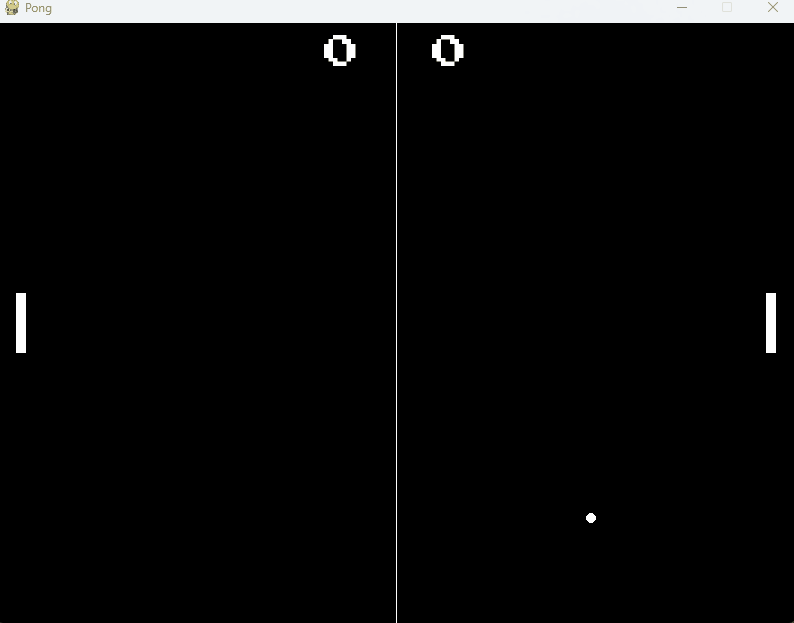

# Ping Pong com Pygames

<p>
  
</p>

```python
# Instalando o pacote pyInstaller
pyinstaller --onefile ping-pong.py
```

# Set das variáveis
```python
import pygame
from pygame import mixer
import sys

#Dando incicio ao jogo e ao som.
pygame.init()
mixer.init()

#Definindo o tamanho da tela, das raquetes, da bola, e a velocidade de ambos
SCREEN_WIDTH =800
SCREEN_HEIGHT = 600
PADDLE_WIDTH = 10
PADDLE_HEIGHT = 60
BALL_SIZE = 10
PADDLE_SPEED = 4
BALL_SPEED = 5

WHITE = (255,255,255)
BLACK = (0,0,0)

font_file = "PressStart2P-Regular"
font = pygame.font.Font(font_file, 36)
score_a = 0
score_b = 0

mixer.music.load("music_game")
mixer.music.set_volume(0.3)
collision_sound_A = mixer.Sound("Sound_A.wav")
collision_sound_B = mixer.Sound("Sound_B.wav")
point_sound = mixer.Sound("Sound_B.wav")

mixer.music.play(-1) #Faz a música tocar em loop
screen = pygame.display.set_mode((SCREEN_WIDTH,SCREEN_HEIGHT)) #está sendo usada para criar uma janela de exibição na biblioteca pygame com dimensões especificadas
pygame.display.set_caption("Pong") #Definindo o título da janela de exibição do jogo como "Pong"

#As linhas de código abaixo estão criando objetos pygame.Rect para representar as raquetes (paddle_a e paddle_b) e a bola (ball) em um jogo. Além disso, estão inicializando as variáveis ball_dx e ball_dy com a velocidade da bola
paddle_a = pygame.Rect(20, SCREEN_HEIGHT // 2 - PADDLE_HEIGHT//2, PADDLE_WIDTH, PADDLE_HEIGHT)
paddle_b = pygame.Rect(SCREEN_WIDTH - 20 - PADDLE_WIDTH, SCREEN_HEIGHT // 2 - PADDLE_HEIGHT//2, PADDLE_WIDTH, PADDLE_HEIGHT)
ball =  pygame.Rect(SCREEN_WIDTH //2 - BALL_SIZE // 2, SCREEN_HEIGHT // 2 - BALL_SIZE//2, BALL_SIZE, BALL_SIZE)
ball_dx, ball_dy = BALL_SPEED, BALL_SPEED

```

# Renderização do Menu


```python
def main_menu():
    while True:
        for event in pygame.event.get():
            if event.type == pygame.QUIT:
                pygame.quit()
                sys.exit()

            if event.type == pygame.KEYDOWN:
                if event.key == pygame.K_SPACE:
                    game_loop()
                elif event.key == pygame.K_ESCAPE:
                    pygame.quit()
                    sys.exit()

        # Renderização do menu principal
        screen.fill(BLACK)
        title_font = pygame.font.Font(font_file, 36)  # Configuração da Fonte
        title_text = title_font.render("Pong", True, WHITE)
        title_rect = title_text.get_rect(center=(SCREEN_WIDTH // 2, SCREEN_HEIGHT // 4))

        screen.blit(title_text, title_rect) #Desenhar o texto do título na tela de exibição.

        title_font = pygame.font.Font(font_file, 16)
        current_time = pygame.time.get_ticks() #Obtém o tempo decorrido em milissegundos desde que o Pygame foi inicializado ou o último reinício do tempo.

        if current_time % 2000 < 1000:
            title_text1 = title_font.render("Pressione espaço para iniciar", True, WHITE)
            title_rect1 = title_text1.get_rect(center=(SCREEN_WIDTH // 2, SCREEN_HEIGHT // 4 + 60)) # cria um retângulo que envolve o texto title_text1 e o posiciona no centro horizontal e a uma certa distância vertical da tela.
            screen.blit(title_text1, title_rect1) #Desenha o texto title_text1 na tela de exibição, utilizando o retângulo title_rect1 para definir sua posição.

        
        pygame.display.flip()
```

#### Explicação da Estrutura a seguir:

```python
    while True:
        for event in pygame.event.get():
            if event.type == pygame.QUIT:
                pygame.quit()
                sys.exit()

            if event.type == pygame.KEYDOWN:
                if event.key == pygame.K_SPACE:
                    game_loop()
                elif event.key == pygame.K_ESCAPE:
                    pygame.quit()
                    sys.exit()
```
<blockquote style="background-color: #E6F0F7;">

Trata-se de uma estrutura práticada por desenvolvedores de jogos utilizando essa biblioteca.

A estrutura envolve a criação de um loop principal *(while True)* que continua executando indefinidamente até que uma condição de término seja encontrada. Dentro desse loop principal, os eventos são verificados em um loop *for* para capturar as interações do jogador, como o fechamento da janela ou pressionar teclas específicas.

</blockquote>


<blockquote style="background-color: #E6F0F7;">

Podemos ver que esse bloco funciona da seguinte forma:

```python
current_time = pygame.time.get_ticks()
```
A função é chamada para obter o tempo em milissegundos desde que o jogo começou.

```python
if current_time % 2000 < 1000:
```
O trecho de código verifica se o resto da divisão da variável *current_time* por 2000 é menor que 1000. Se essa condição for verdadeira, significa que *current_time* está dentro do intervalo de 0 a 999 milissegundos após cada múltiplo de 2000 milissegundos. Essa verificação é usada para criar um efeito piscante.

Por exemplo, se *current_time* for 2500, o resto da divisão por 2000 é 500. Como 500 é menor que 1000, a condição é verdadeira e o código dentro do bloco if será executado. Isso resultará na renderização do texto desejado. Esse efeito piscante é criado porque o texto só será mostrado durante a primeira metade do intervalo de 2000 milissegundos.

</blockquote>

# Game

```python
def game_loop():
    global ball_dx, ball_dy, score_a, score_b, ball #Indica que as variáveis mencionadas são globais e não locais dentro da função em que a declaração é feita

    while True:
        for event in pygame.event.get():
            if event.type == pygame.QUIT:
                pygame.quit()
                sys.exit()
            if event.type == pygame.KEYDOWN:
                if event.key == pygame.K_ESCAPE:
                    return

        #comente
        screen.fill(BLACK) #preenche a tela com a cor preta, limpando qualquer desenho anterior e fornecendo um fundo preto para a próxima renderização.
        pygame.draw.rect(screen, WHITE, paddle_a) #desenha um retângulo branco representando a raquete A na posição e tamanho definidos pela variável 
        pygame.draw.rect(screen, WHITE, paddle_b) #desenha um retângulo branco representando a raquete B na posição e tamanho definidos pela variável 
        pygame.draw.ellipse(screen, WHITE, ball) #desenha uma elipse branca representando a bola na posição e tamanho definidos pela variável 
        pygame.draw.aaline(screen, WHITE, (SCREEN_WIDTH // 2, 0), (SCREEN_WIDTH // 2, SCREEN_HEIGHT)) # desenha uma linha antialiasing branca vertical no centro da tela, dividindo a área de jogo em duas partes.

        #Responsável por obter o estado atual de todas as teclas do teclado.
        keys = pygame.key.get_pressed()

        #Movimento Vertical Raquete A
        if keys[pygame.K_w] and paddle_a.top > 0:
            paddle_a.y -= PADDLE_SPEED
        if keys[pygame.K_s] and paddle_a.bottom < SCREEN_HEIGHT:
            paddle_a.y += PADDLE_SPEED

        #Movimento Vertical Raquete B
        if keys[pygame.K_UP] and paddle_b.top > 0:
            paddle_b.y -= PADDLE_SPEED
        if keys[pygame.K_DOWN] and paddle_b.bottom < SCREEN_HEIGHT:
            paddle_b.y += PADDLE_SPEED

        #Movimento Horizontal Raquete A
        if keys[pygame.K_a] and paddle_a.left > 0:
            paddle_a.x -= PADDLE_SPEED
        if keys[pygame.K_d] and paddle_a.right < SCREEN_WIDTH // 2 - 70:
            paddle_a.x += PADDLE_SPEED

        #Movimento Horizontal Raquete B
        #Do it
        # >
        # >
        # >
        # >
        # >
      
        # Atualização da posição da bola
        ball.x += ball_dx
        ball.y += ball_dy


        if ball.colliderect(paddle_a):
            ball.left = paddle_a.right
            ball_dx = -ball_dx
            collision_sound_A.play()

        elif ball.colliderect(paddle_b):
            ball.right = paddle_b.left
            ball_dx = -ball_dx
            collision_sound_B.play()

        #Continue...
        #Do it
        # >
        # >
        # >
        # >
        # >


        #Bola quando bate na extremidade da tela
        if ball.top <= 0 or ball.bottom >= SCREEN_HEIGHT:
            ball_dy = -ball_dy

        #Ponto para o Time B
        if ball.left <= 0:
            score_b += 1
            ball.x = SCREEN_WIDTH // 2 - BALL_SIZE // 2
            ball.y = SCREEN_HEIGHT // 2 - BALL_SIZE // 2
            ball_dx = -ball_dx
            point_sound.play()
            # print(score_b)
            if score_b == 10: #Se a pontuação do b for = 10, finaliza o jogo
                end_game(False)

        #Ponto para o Time A
        elif ball.right >= SCREEN_WIDTH:
            score_a += 1
            ball.x = SCREEN_WIDTH // 2 - BALL_SIZE // 2
            ball.y = SCREEN_HEIGHT // 2 - BALL_SIZE // 2
            ball_dx = -ball_dx
            point_sound.play()
            # print(score_a)
            if score_a == 10: #e a pontuação do a for = 10, finaliza o jogo
                end_game(True)

        # Placar na Tela
        score_text = font.render(f"{score_a}  {score_b}", True, WHITE)
        score_rect = score_text.get_rect(center=(SCREEN_WIDTH // 2, 30))
        screen.blit(score_text, score_rect)

        # Atualizar a tela
        pygame.display.flip()

        # Controlar FPS
        clock = pygame.time.Clock()
        clock.tick(60)
```

<blockquote style="background-color: #EAB8AD;">

Explique o Movimento Vertical colocando o código e comentando detalhadamente.

</blockquote>

<blockquote style="background-color: #EAB8AD;">

Explique o Movimento Horizontal colocando o código e comentando detalhadamente.

</blockquote>

<blockquote style="background-color: #EAB8AD;">

Explique o Sistema de Colisão colocando o código e comentando detalhadamente.

Obs: Procure uma função que deixe o código conciso (Opcional). 

</blockquote>

<blockquote style="background-color: #EAB8AD;">

Explique o Sistema de Pontuação colocando o código e comentando detalhadamente.

</blockquote>

#Fim de Jogo

```python
def end_game(winner): 
    while True:
        for event in pygame.event.get():
            if event.type == pygame.QUIT:
                pygame.quit()
                sys.exit()
            if event.type == pygame.KEYDOWN:
                if event.key == pygame.K_SPACE:
                    reset_game()
                    return
                elif event.key == pygame.K_ESCAPE:
                    pygame.quit()
                    sys.exit()

       
        mixer.music.stop()
        screen.fill(BLACK)
        #Comente
        if winner:
            winner_text = "Player 2 Wins!"
        else:
            winner_text = "Player 1 Wins!"

        # Renderização da tela de fim de jogo
        winner_font = pygame.font.Font(font_file, 36)
        winner_render = winner_font.render(winner_text, True, WHITE)
        winner_rect = winner_render.get_rect(center=(SCREEN_WIDTH // 2, SCREEN_HEIGHT // 4))
        screen.blit(winner_render, winner_rect)
        pygame.display.flip()
```
<blockquote style="background-color: #EAB8AD;">

Explique a função *end_game(winner)* de maneira geral

</blockquote>

# Reiniciando o Jogo
```python
def reset_game():
    global paddle_a, paddle_b, ball, ball_dx, ball_dy, score_a, score_b

    paddle_a = pygame.Rect(20, SCREEN_HEIGHT // 2 - PADDLE_HEIGHT // 2, PADDLE_WIDTH, PADDLE_HEIGHT)
    paddle_b = pygame.Rect(SCREEN_WIDTH - 20 - PADDLE_WIDTH, SCREEN_HEIGHT // 2 - PADDLE_HEIGHT // 2, PADDLE_WIDTH, PADDLE_HEIGHT)
    ball = pygame.Rect(SCREEN_WIDTH // 2 - BALL_SIZE // 2, SCREEN_HEIGHT // 2 - BALL_SIZE // 2, BALL_SIZE, BALL_SIZE)
    ball_dx, ball_dy = BALL_SPEED, BALL_SPEED
    score_a, score_b = 0, 0
```

<blockquote style="background-color: #EAB8AD;">

Explique o código de maneira geral.

</blockquote>

# Pontos de melhorias (Opcional):

- Existem blocos de códigos reduntantes.
- Criar classes ao invés de simples funções (modular o código).
- Procurar funções para deixar o código mais conciso. 

# Desafios

- Aumentar a velocidade da bola depois de 5 pontos marcados.

