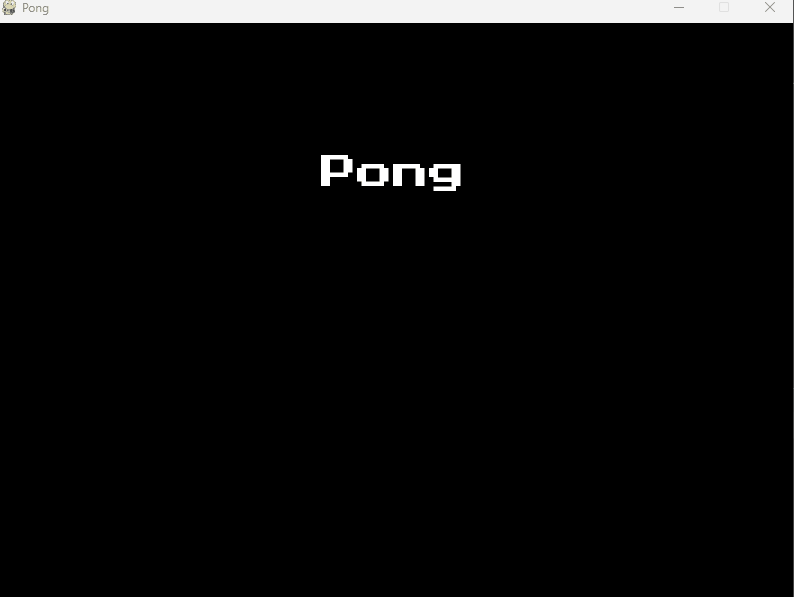

# Ping Pong com Pygames

<p>
  
</p>

```python
# Instalando o pacote pyInstaller
pyinstaller --onefile ping-pong.py
```

# Set das variáveis
```python
import pygame  # Biblioteca principal do Pygame
from pygame import mixer  # Submódulo de áudio do Pygame
import sys  # Módulo do sistema

#Dando incicio ao jogo e ao som.
pygame.init()
mixer.init()

# Configuração da tela
# Largura e altura da tela
SCREEN_WIDTH = 800  # Largura da tela em pixels
SCREEN_HEIGHT = 600  # Altura da tela em pixels

# Dimensões das paletas e bola
PADDLE_WIDTH = 10  # Largura da paleta em pixels
PADDLE_HEIGHT = 60  # Altura da paleta em pixels
BALL_SIZE = 10  # Tamanho da bola em pixels

# Velocidade das paletas e da bola
PADDLE_SPEED = 4  # Velocidade de movimento das paletas
BALL_SPEED = 5  # Velocidade de movimento da bola

# Cores
WHITE = (255, 255, 255)  # Cor branca
BLACK = (0, 0, 0)  # Cor preta

font_file = "PressStart2P-Regular" #inho para o arquivo de fonte
font = pygame.font.Font(font_file, 36) # Objeto de fonte com tamanho 36
score_a = 0 # Pontuação do jogador A
score_b = 0 #  Pontuação do jogador B

# Carregamento das músicas e sons
mixer.music.load("music_game") # Carrega a música de fundo
mixer.music.set_volume(0.3) # Define o volume da música
collision_sound_A = mixer.Sound("Sound_A.wav") # Carrega o som de colisão A
collision_sound_B = mixer.Sound("Sound_B.wav") # Carrega o som de colisão B
point_sound = mixer.Sound("Sound_B.wav") # Carrega o som de ponto

mixer.music.play(-1) #Faz a música tocar em loop
# Configuração da tela do jogo
screen = pygame.display.set_mode((SCREEN_WIDTH, SCREEN_HEIGHT))  # Cria a tela do jogo com a largura e altura especificadas
pygame.display.set_caption("Pong")  # Define o título da janela do jogo

# Definição das posições e dimensões das paletas e bola
paddle_a = pygame.Rect(20, SCREEN_HEIGHT // 2 - PADDLE_HEIGHT // 2, PADDLE_WIDTH, PADDLE_HEIGHT)  # Paleta A
paddle_b = pygame.Rect(SCREEN_WIDTH - 20 - PADDLE_WIDTH, SCREEN_HEIGHT // 2 - PADDLE_HEIGHT // 2, PADDLE_WIDTH, PADDLE_HEIGHT)  # Paleta B
ball = pygame.Rect(SCREEN_WIDTH // 2 - BALL_SIZE // 2, SCREEN_HEIGHT // 2 - BALL_SIZE // 2, BALL_SIZE, BALL_SIZE)  # Bola
ball_dx, ball_dy = BALL_SPEED, BALL_SPEED  # Velocidade de movimento da bola

```

# Renderização do Menu

```python
def main_menu():
    while True:
        for event in pygame.event.get():
            if event.type == pygame.QUIT:
                pygame.quit()  # Encerra o pygame
                sys.exit()  # Encerra o programa

            if event.type == pygame.KEYDOWN:
                if event.key == pygame.K_SPACE:
                    game_loop()  # Inicia o loop do jogo
                elif event.key == pygame.K_ESCAPE:
                    pygame.quit()  # Encerra o pygame
                    sys.exit()  # Encerra o programa

        # Renderização do menu principal
        screen.fill(BLACK)  # Preenche a tela com a cor preta
        title_font = pygame.font.Font(font_file, 36)  # Configuração da Fonte
        title_text = title_font.render("Pong", True, WHITE)  # Renderiza o texto do título
        title_rect = title_text.get_rect(center=(SCREEN_WIDTH // 2, SCREEN_HEIGHT // 4))  # Posição do texto do título

        screen.blit(title_text, title_rect)  # Desenha o texto do título na tela

        title_font = pygame.font.Font(font_file, 16)  # Configuração da Fonte
        current_time = pygame.time.get_ticks()  # Obtém o tempo atual em milissegundos

        if current_time % 2000 < 1000:
            title_text1 = title_font.render("Pressione espaço para iniciar", True, WHITE)  # Renderiza o texto de instrução
            title_rect1 = title_text1.get_rect(center=(SCREEN_WIDTH // 2, SCREEN_HEIGHT // 4 + 60))  # Posição do texto de instrução
            screen.blit(title_text1, title_rect1)  # Desenha o texto de instrução na tela

        pygame.display.flip()  # Atualiza a tela
```

#### Explicação da Estrutura a seguir:
Trata-se de uma estrutura práticada por desenvolvedores de jogos utilizando essa biblioteca.

A estrutura envolve a criação de um loop principal *(while True)* que continua executando indefinidamente até que uma condição de término seja encontrada. Dentro desse loop principal, os eventos são verificados em um loop *for* para capturar as interações do jogador, como o fechamento da janela ou pressionar teclas específicas.

```python
    while True:
        for event in pygame.event.get():
            if event.type == pygame.QUIT:
                pygame.quit()
                sys.exit()

            if event.type == pygame.KEYDOWN:
                if event.key == pygame.K_SPACE:
                    game_loop()
                elif event.key == pygame.K_ESCAPE:
                    pygame.quit()
                    sys.exit()
```

# Game

```python
def game_loop():
    global ball_dx, ball_dy, score_a, score_b, ball  # Variáveis globais para controle do jogo

    while True:
        for event in pygame.event.get():  # Loop de eventos do pygame
            if event.type == pygame.QUIT:  # Verifica se o evento é de saída do jogo
                pygame.quit()  # Encerra o pygame
                sys.exit()  # Encerra o programa
            if event.type == pygame.KEYDOWN:  # Verifica se alguma tecla foi pressionada
                if event.key == pygame.K_ESCAPE:  # Verifica se a tecla pressionada é ESCAPE
                    return  # Sai do loop do jogo

        screen.fill(BLACK)  # Limpa a tela preenchendo-a com a cor preta
        pygame.draw.rect(screen, WHITE, paddle_a)  # Desenha a raquete A
        pygame.draw.rect(screen, WHITE, paddle_b)  # Desenha a raquete B
        pygame.draw.ellipse(screen, WHITE, ball)  # Desenha a bola
        pygame.draw.aaline(screen, WHITE, (SCREEN_WIDTH // 2, 0),
                           (SCREEN_WIDTH // 2, SCREEN_HEIGHT))  # Desenha uma linha vertical no centro da tela

        keys = pygame.key.get_pressed()  # Obtém o estado das teclas pressionadas

        # O trecho de código a seguir presente no #Movimento Vertical Raquete A e B é responsável pelo moviemnto vertical das raquetes A e B, na qual ele verifica a tecla que foi pressionada e realiza o movimento da respectiva raquete verticalmente até o limite vertical da tela.
        # Movimento Vertical Raquete A
        if keys[
            pygame.K_w] and paddle_a.top > 0:  # Verifica se a tecla 'w' foi pressionada e se a raquete A não está no topo da tela
            paddle_a.y -= PADDLE_SPEED  # Move a raquete A para cima
        if keys[
            pygame.K_s] and paddle_a.bottom < SCREEN_HEIGHT:  # Verifica se a tecla 's' foi pressionada e se a raquete A não está na parte inferior da tela
            paddle_a.y += PADDLE_SPEED  # Move a raquete A para baixo

        # Movimento Vertical Raquete B
        if keys[
            pygame.K_UP] and paddle_b.top > 0:  # Verifica se a seta para cima foi pressionada e se a raquete B não está no topo da tela
            paddle_b.y -= PADDLE_SPEED  # Move a raquete B para cima
        if keys[
            pygame.K_DOWN] and paddle_b.bottom < SCREEN_HEIGHT:  # Verifica se a seta para baixo foi pressionada e se a raquete B não está na parte inferior da tela
            paddle_b.y += PADDLE_SPEED  # Move a raquete B para baixo

        # O trecho a seguir presente no #Movimento Horizontal Raquete A e B é responsável pelo moviemnto horizontal das raquetes A e B, na qual ele verifica a tecla que foi pressionada e realiza o movimento da respectiva raquete horizontalmente até o limite horizontal do meio da tela.
        # Movimento Horizontal Raquete A
        if keys[
            pygame.K_a] and paddle_a.left > 0:  # Verifica se a tecla 'a' foi pressionada e se a raquete A não está no limite esquerdo da tela
            paddle_a.x -= PADDLE_SPEED  # Move a raquete A para a esquerda
        if keys[
            pygame.K_d] and paddle_a.right < SCREEN_WIDTH // 2 - 70:  # Verifica se a tecla 'd' foi pressionada e se a raquete A não está no limite direito da tela
            paddle_a.x += PADDLE_SPEED  # Move a raquete A para a direita

        # Movimento Horizontal Raquete B
        if keys[
            pygame.K_LEFT] and paddle_b.left > SCREEN_WIDTH // 2 + 70:  # Verifica se a seta para a esquerda foi pressionada e se a raquete B não está no limite esquerdo da tela
            paddle_b.x -= PADDLE_SPEED  # Move a raquete B para a esquerda
        if keys[
            pygame.K_RIGHT] and paddle_b.right < SCREEN_WIDTH:  # Verifica se a seta para a direita foi pressionada e se a raquete B não está no limite direito da tela
            paddle_b.x += PADDLE_SPEED  # Move a raquete B para a direita

        # Atualização da posição da bola
        ball.x += ball_dx  # Atualiza a posição horizontal da bola
        ball.y += ball_dy  # Atualiza a posição vertical da bola

        # A seguir segue o comportamento da bola quando colide com os cantos ou com as raquetes
        if ball.colliderect(paddle_a):  # Verifica se a bola colidiu com a raquete A
            ball.left = paddle_a.right  # Reposiciona a bola à direita da raquete A
            ball_dx = -ball_dx  # Inverte a direção horizontal da bola
            collision_sound_A.play()  # Reproduz o som de colisão para a raquete A

        elif ball.colliderect(paddle_b):  # Verifica se a bola colidiu com a raquete B
            ball.right = paddle_b.left  # Reposiciona a bola à esquerda da raquete B
            ball_dx = -ball_dx  # Inverte a direção horizontal da bola
            collision_sound_B.play()  # Reproduz o som de colisão para a raquete B

        elif ball.colliderect(paddle_a):  # Verifica se a bola colidiu com a raquete A (caso especial)
            ball.left = paddle_b.topright  # Reposiciona a bola no canto superior direito da raquete B
            ball_dx = -ball_dx  # Inverte a direção horizontal da bola
            collision_sound_B.play()  # Reproduz o som de colisão para a raquete B

        elif ball.colliderect(paddle_b):  # Verifica se a bola colidiu com a raquete B (caso especial)
            ball.right = paddle_b.topleft  # Reposiciona a bola no canto superior esquerdo da raquete B
            ball_dx = -ball_dx  # Inverte a direção horizontal da bola
            collision_sound_B.play()  # Reproduz o som de colisão para a raquete B

        # Bola quando bate na extremidade da tela
        if ball.top <= 0 or ball.bottom >= SCREEN_HEIGHT:  # Verifica se a bola atingiu a parte superior ou inferior da tela
            ball_dy = -ball_dy  # Inverte a direção vertical da bola

        # Nos trechos a seguir determina quando deve aumentar a pontuação para determinado time
        # Ponto para o Time B
        if ball.left <= 0:  # Verifica se a bola ultrapassou a borda esquerda da tela
            score_b += 1  # Incrementa o placar do Time B
            ball.x = SCREEN_WIDTH // 2 - BALL_SIZE // 2  # Reposiciona a bola no centro horizontal da tela
            ball.y = SCREEN_HEIGHT // 2 - BALL_SIZE // 2  # Reposiciona a bola no centro vertical da tela
            ball_dx = -ball_dx  # Inverte a direção horizontal da bola
            point_sound.play()  # Reproduz o som de ponto marcado
            if score_b == 10:  # Verifica se o Time B alcançou a pontuação de 10 (comente)
                end_game(False)  # Chama a função de fim de jogo para o Time B

        # Ponto para o Time A
        elif ball.right >= SCREEN_WIDTH:  # Verifica se a bola ultrapassou a borda direita da tela
            score_a += 1  # Incrementa o placar do Time A
            ball.x = SCREEN_WIDTH // 2 - BALL_SIZE // 2  # Reposiciona a bola no centro horizontal da tela
            ball.y = SCREEN_HEIGHT // 2 - BALL_SIZE // 2  # Reposiciona a bola no centro vertical da tela
            ball_dx = -ball_dx  # Inverte a direção horizontal da bola
            point_sound.play()  # Reproduz o som de ponto marcado
            if score_a == 10:  # Verifica se o Time A alcançou a pontuação de 10 (comente)
                end_game(True)  # Chama a função de fim de jogo para o Time A

        # Placar na Tela
        score_text = font.render(f"{score_a}  {score_b}", True,
                                 WHITE)  # Renderiza o texto do placar com a pontuação dos times
        score_rect = score_text.get_rect(
            center=(SCREEN_WIDTH // 2, 30))  # Obtém o retângulo que engloba o texto do placar e centraliza na tela
        screen.blit(score_text, score_rect)  # Desenha o texto do placar na tela

        # Atualizar a tela
        pygame.display.flip()  # Atualiza a tela para exibir as alterações feitas

        # Controlar FPS
        clock = pygame.time.Clock()  # Cria um objeto Clock para controlar a taxa de atualização da tela
        clock.tick(60)  # Limita a taxa de atualização para 60 quadros por segundo (FPS)

```
# Final de jogo

```python
def end_game(winner):
    while True:
        for event in pygame.event.get():  # Loop para tratar os eventos
            if event.type == pygame.QUIT:  # Se o evento for sair do jogo
                pygame.quit()  # Encerra o pygame
                sys.exit()  # Encerra o programa
            if event.type == pygame.KEYDOWN:  # Se o evento for uma tecla pressionada
                if event.key == pygame.K_SPACE:  # Se a tecla pressionada for a barra de espaço
                    reset_game()  # Reinicia o jogo
                    return  # Retorna ao loop principal
                elif event.key == pygame.K_ESCAPE:  # Se a tecla pressionada for a tecla Esc
                    pygame.quit()  # Encerra o pygame
                    sys.exit()  # Encerra o programa

        mixer.music.stop()  # Para a reprodução da música
        screen.fill(BLACK)  # Preenche a tela com a cor preta

        if winner:
            winner_text = "Player 2 Wins!"  # Define o texto de vitória para o jogador 2
        else:
            winner_text = "Player 1 Wins!"  # Define o texto de vitória para o jogador 1

        # Renderização da tela de fim de jogo
        winner_font = pygame.font.Font(font_file, 36)  # Define a fonte e o tamanho do texto
        winner_render = winner_font.render(winner_text, True, WHITE)  # Renderiza o texto com a cor branca
        winner_rect = winner_render.get_rect(
            center=(SCREEN_WIDTH // 2, SCREEN_HEIGHT // 4))  # Define a posição do texto
        screen.blit(winner_render, winner_rect)  # Desenha o texto na tela
        pygame.display.flip()  # Atualiza a tela
```
# Reiniciar Game

```python
def reset_game():
    global paddle_a, paddle_b, ball, ball_dx, ball_dy, score_a, score_b

    # Reinicialização das variáveis do jogo
    paddle_a = pygame.Rect(20, SCREEN_HEIGHT // 2 - PADDLE_HEIGHT // 2, PADDLE_WIDTH, PADDLE_HEIGHT)  # Posiciona a raquete A
    paddle_b = pygame.Rect(SCREEN_WIDTH - 20 - PADDLE_WIDTH, SCREEN_HEIGHT // 2 - PADDLE_HEIGHT // 2, PADDLE_WIDTH, PADDLE_HEIGHT)  # Posiciona a raquete B
    ball = pygame.Rect(SCREEN_WIDTH // 2 - BALL_SIZE // 2, SCREEN_HEIGHT // 2 - BALL_SIZE // 2, BALL_SIZE, BALL_SIZE)  # Posiciona a bola
    ball_dx, ball_dy = BALL_SPEED, BALL_SPEED  # Define a velocidade da bola
    score_a, score_b = 0, 0  # Zera os pontos dos jogadores A e B
```